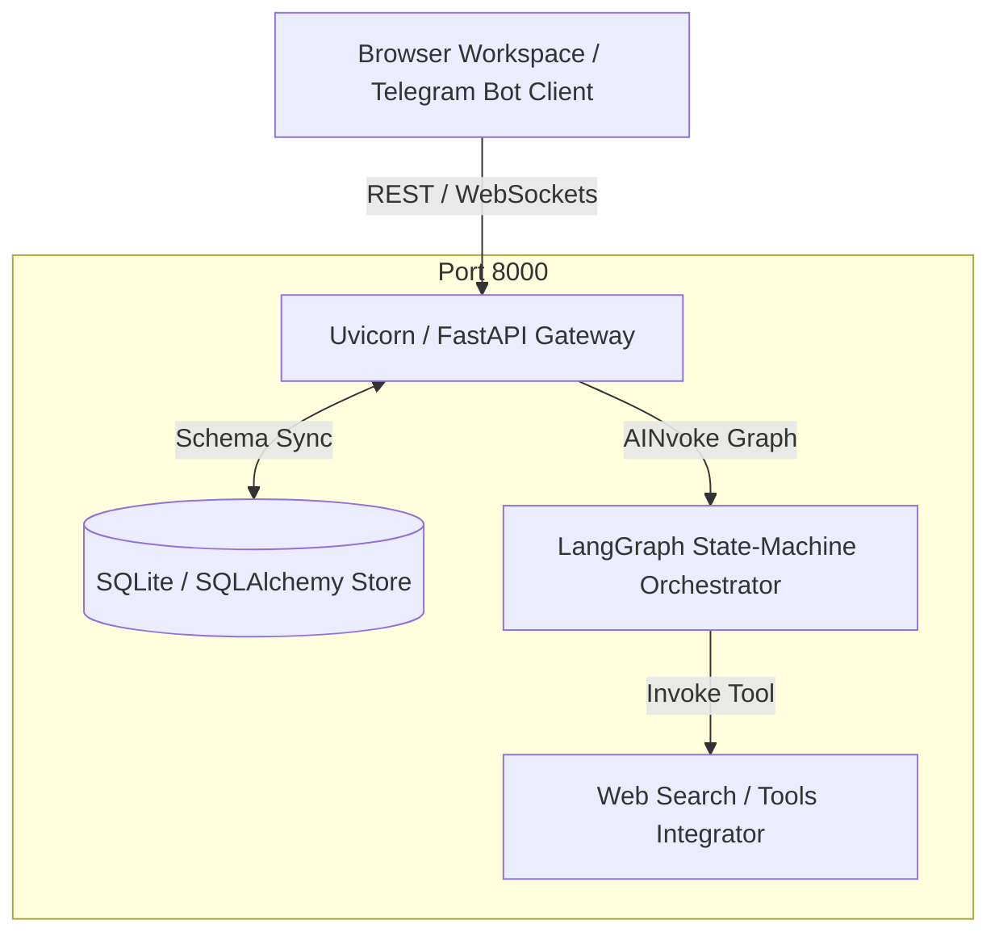

# Yuno: Multi-Agent Orchestration & Evaluation Platform

Yuno is a robust senior-engineered multi-agent task execution platform featuring a visual pipeline graph builder canvas, dynamic conditional routing loops, real-time tracers, and direct Telegram polling webhook channels.

## 📐 Architecture Diagram



---

## 💡 Engineering Highlights

### 1. Why LangGraph vs. Alternatives (e.g. CrewAI)
> LangGraph provides explicit state machines for agent workflows, making conditional routing, cycles, and multi-agent coordination explicit and debuggable — unlike CrewAI which abstracts too much. This state-oriented model ensures perfect telemetry, loop containment throttles, and feedback cycles without unpredictable black-box anomalies.

### 2. Why FastAPI + SQLite
> Fully local, zero infra overhead, single setup command. Ensures developers, QA Leads, and compliance reviews can boot and inspect transactions, runs, and memories locally instantly with zero third-party licensing dependencies.

### 3. Why Telegram Bot API
> No approval required, free API, python-telegram-bot has mature async support. Perfect for demonstrating live client-facing automated workflows of active agents.

---

## 🛠️ Setup Instructions

### Pre-requisites
- Python 3.11+
- Node.js 18+
- OpenAI GPT-4o API credentials

### Initializing Environment
To trigger complete codebase installation, run the automated setup utility script:
```bash
./setup.sh
```

To ignite simultaneously backend microservice and Vite interactive dashboard local listeners:
```bash
./start.sh
```
- **Backend Access**: [http://localhost:8000](http://localhost:8000)
- **Frontend Dashboard**: [http://localhost:5173](http://localhost:5173)

---

## 🗺️ Extension Tutorials

### How to add a new Workflow Template (Step-by-Step)
1. Open `/backend/main.py` and inspect the `seed_database_templates()` method declaration space.
2. Formulate a new `DB_Workflow` instance containing a unique pipeline identifier e.g. `wf-template-finance-audit`.
3. Model your sequence graph inside the `graph_definition` JSON object:
   ```python
   graph_definition={
       "nodes": [
           {"id": "n-init", "type": "input", "label": "Raw Audit Topic"},
           {"id": "n-audit", "type": "agent", "agentId": "agent-finance-reviewer", "label": "Tax Analyst Review"},
           {"id": "n-sign", "type": "output", "label": "Issue Audit Statement"}
       ],
       "edges": [
           {"id": "ed-1", "source": "n-init", "target": "n-audit"},
           {"id": "ed-2", "source": "n-audit", "target": "n-sign"}
       ]
   }
   ```
4. Commit the db writes via `db.add_all([your_new_workflow])` and restart the FastAPI server program.

### How to add a new Messaging Channel (Step-by-Step)
1. Add target SDK definitions to `/backend/requirements.txt` (e.g., Slack or Twilio WhatsApp).
2. Create an integration coordinator file e.g. `/backend/integrations/whatsapp_bot.py`.
3. Construct an asynchronous listener setup pulling messages from webhooks:
   ```python
   async def handle_whatsapp_webhook(payload: dict):
       # 1. Parse client text input
       incoming_text = payload.get("message_text")
       
       # 2. Query target agent profile from SQLite
       agent = db.query(DB_Agent).filter(DB_Agent.id == "agent-support").first()
       
       # 3. Request LLM completion trace
       response_content = await call_agent_brain(agent, incoming_text)
       
       # 4. Dispatch final SMS payload using WhatsApp Web API.
   ```
4. Attach this background task loop inside `/backend/main.py` lifespan context scheduler so it ignites during server boot.
